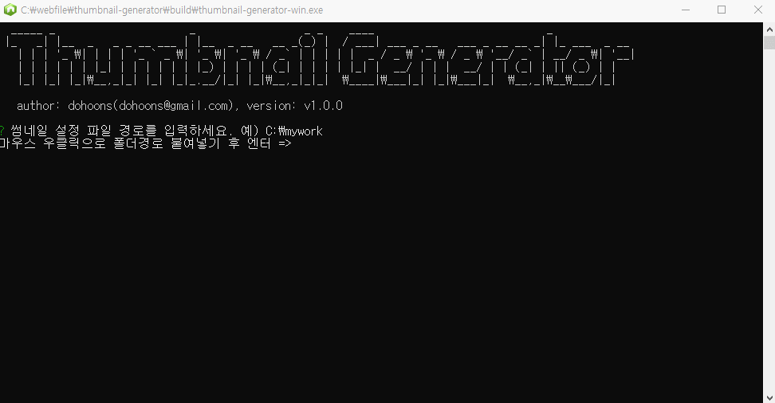

# Thumbnail Generator



## 다운로드
https://github.com/dohoons/thumbnail-generator/releases/download/1.0.0/thumbnail-generator-v1.0.zip

## 설정파일 구성
설정파일을 이미지세트 폴더 별로 복사해서 사용하세요.

thumbnail-config.ini
```ini
; 입력파일 경로 (여러개의 파일 가능, *: png,jpg,gif 일괄 지정)
input[]=input/large.jpg
input[]=input/large2.jpg
input[]=input/large3.jpg
input[]=input/multi/*

; 출력파일 이름 (생략시 input 파일이름)
outputName[]=

; 출력파일 폴더경로 (현재폴더=빈값)
outputDir=output

; 출력파일 포맷
outputFormat=jpg

; 썸네일 옵션
;   width, height 설정 (한쪽만 설정하면 비율리사이즈)
;   background: 배경색 설정 (기본값 "ffffff", png 파일에는 값을 설정한 경우에만 적용됨)
;   quality: jpg 포맷인경우에는 압축률 설정 (기본값 80)
;   fit: contain 또는 cover (기본값 contain)

thumnail[]={ "width": 300, "height": 500, "quality": 80 }
thumnail[]={ "width": 300, "height": 100, "quality": 80 }
thumnail[]={ "width": 200, "height": 200, "quality": 80 }
thumnail[]={ "width": 100, "height": 100, "quality": 80 }
```

## 변환 이미지 샘플
| 구분 | 이미지 |
| --- | --- |
| 원본 |  |
| 100x100 |  |
| 200x200 |  |
| 300x100 |  |
| 300x500 |  |